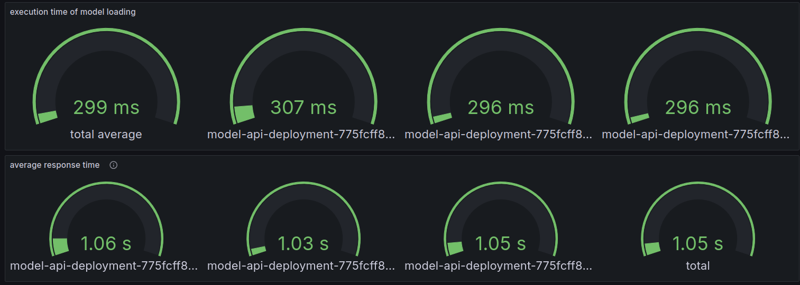
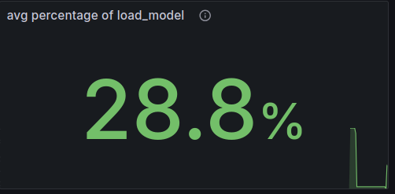
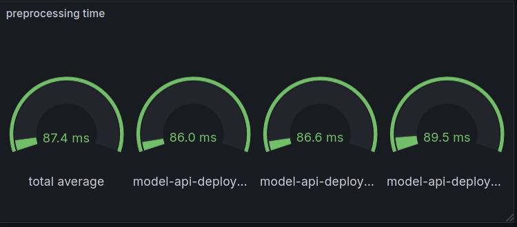
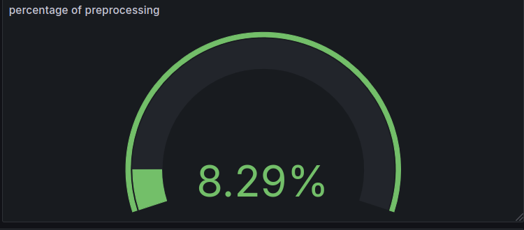

### Automization of performance testing

#### The script

To fire a number of `n` different reviews from a given csv-file to the REST-API where the model lives, a script is
created.
This script will be able to:

- take a flag `-n` which defines the number of reviews to fire up.
- take a flag `-f` which defines the filepath where the reviews are defined
- a flag `-s` which will be the separator in this file.

##### Prerequisites

- all reviews from a given file are written within `"`-characters.
    - e.g. `"wow, what a really nice movie"`

##### Technologies

The basic script with the business logic of extracting the reviews and make the remote call to the REST-API will be
written using Python. Python has an excellent support for csv file handling.
The Python script will be wrapped into a classic bash script, where the flags are handled and the Python script will be
called.

### Run the script

#### 100 Reviews

Running the script for the first time with `n=100` ends up in the following metrics collected with prometheus and
visualized with grafana:

You can see two different metrics, collected for each of three pods and a total average over all three pods.
There is an average time of the load_model function measured.
Further you can see that the total average response time is 1.05 seconds.

The percentage of the load_model function on the total average response time is about 28.8%.

That means almost a third of the total execution time in our REST-API is consumed by loading the model with tensorflow.
Here, we can see the first potential for improvement

- Using mechanisms to speed up the model loading

The execution time of the review preprocessing seems not be a problem using 100 reviews.

Let's go further with the performance testing and increase the numbers and see how the REST-API behaves.

| Reviews | preprocessing time total avg | load_model time total avg | percentage preprocessing | percentage load_model | avg response time |
|---------|------------------------------|---------------------------|--------------------------|-----------------------|-------------------|
| 100     | 87.4 ms                      | 299 ms                    | 8.29 %                   | 28.8 %                | 1.05 s            |
| 1000    | 96.6 ms                      | 303 ms                    | 8.79 %                   | 27.6 %                | 1.10 s            |                 
| 5000    | -                            | -                         | -                        | -                     | -                 |
| 10000   | -                            | -                         | -                        | -                     | -                 |
| 25000   | -                            | -                         | -                        | -                     | -                 |
